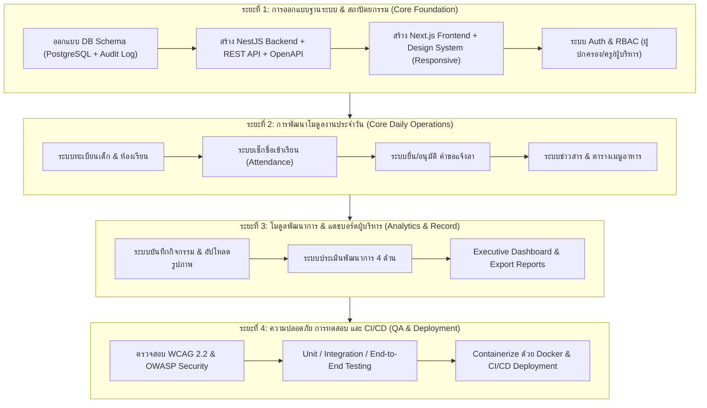

# แผนการพัฒนาเว็บแอปพลิเคชันบริหารจัดการและสื่อสารข้อมูล ศูนย์พัฒนาเด็กเล็ก เทศบาลเมืองบางใหญ่ จังหวัดนนทบุรี (Child Center MIS)

แผนงานนี้จัดทำขึ้นตามข้อกำหนด สถาปัตยกรรมระบบ ขอบเขตงาน และแนวทางการพัฒนาที่ระบุไว้ในเอกสารทั้ง 3 ฉบับ ได้แก่ `Project_Outline_Child_Center_Bang_Yai.pdf`, `Proposal_Child_Center_Bang_Yai.pdf` และ `Bang_Yai_Child_Development_Center_Research_Proposal (1).pdf`

---

## 📌 ภาพรวมโครงการ (Project Overview)

โครงการมีเป้าหมายเพื่อแก้ปัญหาข้อมูลกระจัดกระจาย งานบันทึกซ้ำซ้อน และข่าวสารตกหล่น โดยการพัฒนา **Responsive Web Application / PWA** ศูนย์กลางข้อมูลที่ทำงานบนฐานข้อมูลเดียวกัน (Single Source of Truth) รองรับการใช้งานตามบทบาท (Role-Based Access Control: RBAC) สำหรับ 3 กลุ่มผู้ใช้หลัก ได้แก่ **ผู้ปกครอง**, **ครู/ผู้ดูแลเด็ก** และ **ผู้บริหาร/เทศบาล**

### Tech Stack หลักตามเอกสารวิจัย
- **Frontend**: Next.js + TypeScript (Responsive / Mobile-first Design ตามมาตรฐาน WCAG 2.2)
- **Backend**: NestJS (REST API + Validation + DTO + OpenAPI/Swagger)
- **Database Layer**: PostgreSQL (Relational DB) + Object Storage (จัดเก็บรูปภาพ/เอกสาร) + Audit Log Database Schema
- **DevOps & Infrastructure**: Docker, Docker Compose, GitHub Actions (CI/CD Pipeline)

---

## 👥 โครงสร้างบทบาทผู้ใช้และสิทธิ์การใช้งาน (RBAC Matrix)

| ฟังก์ชัน / โมดูล | ผู้ปกครอง (Parent) | ครู / ผู้ดูแลเด็ก (Teacher) | ผู้บริหาร / เทศบาล (Executive) |
| :--- | :---: | :---: | :---: |
| **ดูข้อมูลเด็ก / ทะเบียน** | เฉพาะบุตรหลานตนเอง | เฉพาะห้องที่รับผิดชอบ | ข้อมูลเด็กทั้งหมดในศูนย์ |
| **เช็กชื่อการเข้าเรียน** | ดูประวัติการมาเรียน | บันทึก/แก้ไข เช็กชื่อรายวัน | ดูสถิติสรุปภาพรวม |
| **ยื่นคำขอแจ้งลา** | ส่งคำขอ & ติดตามสถานะ | อนุมัติ / ตอบรับคำขอ | ดูสถิติการขอลารวม |
| **ข่าวสาร & ประกาศ** | รับข่าวสาร / ตอบรับ | สร้าง/แก้ไข/เผยแพร่ข่าวสาร | ดูประกาศทั้งหมด |
| **เมนูอาหารประจำวัน** | ดูรายการอาหาร | บันทึก/อัปเดตรายการอาหาร | ดูรายการอาหาร |
| **ตาราง & บันทึกกิจกรรม** | ดูภาพ/บันทึกกิจกรรม | บันทึกกิจกรรม + อัปโหลดรูป | ดูสรุปกิจกรรม |
| **บันทึกพัฒนาการ (4 ด้าน)**| ดูพัฒนาการบุตรหลาน | ประเมิน/บันทึกตามช่วงวัย | ดูภาพรวมพัฒนาการ |
| **Dashboard & Reports** | - | - | แดชบอร์ดสถิติ & สรุปรายงาน |

---

## 🧩 รายละเอียด 8 โมดูลหลักของระบบ (Core Modules)

1. **ระบบทะเบียนเด็กและผู้ใช้งาน (User & Child Registry Module)**
   - จัดการข้อมูลเด็ก ประวัติผู้ปกครอง ครูผู้ดูแล และการจับคู่ผู้ปกครองกับเด็ก (Parent-Child Mapping)
   - ระบบลงชื่อเข้าใช้ Security Tokens (JWT / Session Authentication) และ RBAC Middleware

2. **ระบบเช็กชื่อการเข้าเรียน (Attendance Check-in Module)**
   - อินเทอร์เฟซ Mobile-first สำหรับครู เช็กชื่อ มา/ขาด/สาย/ลา ได้รวดเร็วในหน้าเดียว
   - ผู้ปกครองได้รับการแจ้งเตือน/ดูสถานะการเข้าเรียนของบุตรหลานได้แบบ Real-time

3. **ระบบคำขอแจ้งลา (Leave Request & Approval Module)**
   - ผู้ปกครองยื่นคำขอแจ้งลา (ป่วย/กิจจำเป็น) พร้อมระบุวันที่และเหตุผล
   - ครูตรวจสอบ ตอบรับ/อนุมัติ พร้อมระบบเก็บสถานะย้อนหลัง

4. **ระบบข่าวสารและประกาศ (News & Communications Module)**
   - ประกาศข่าวสารทั่วไป กิจกรรมสำคัญ และข่าวสารเฉพาะกลุ่ม/เฉพาะห้องเรียน
   - ระบบติดตามสถานะการอ่าน (Read Receipts) และประวัติการสื่อสาร

5. **ระบบรายการอาหารประจำวัน (Meal Menu Module)**
   - ตารางโภชนาการและรายการอาหารเช้า/กลางวัน/อาหารว่างประจำวันและประจำสัปดาห์
   - แสดงผลชัดเจนให้อ่านง่ายสำหรับผู้ปกครองบนโทรศัพท์มือถือ

6. **ระบบบันทึกกิจกรรมประจำวัน (Daily Activity Log Module)**
   - บันทึกตารางกิจกรรมการเรียนรู้ การเล่น และการปฏิบัติกิจวัตรประจำวัน
   - อัปโหลดและจัดเก็บรูปภาพกิจกรรมลงใน Object Storage

7. **ระบบบันทึกพัฒนาการรายบุคคล (Child Development Record Module)**
   - บันทึกการสังเกตและประเมินพัฒนาการ 4 ด้าน (ร่างกาย, อารมณ์-จิตใจ, สังคม, สติปัญญา) ตามเกณฑ์มาตรฐานเด็กปฐมวัย
   - แสดงผลแนวโน้มการเติบโตและพัฒนาการ (ไม่ใช่เครื่องมือวินิจฉัยทางการแพทย์)

8. **ระบบผู้บริหารและรายงาน (Executive Dashboard & Reporting Module)**
   - Dashboard สรุปตัวชี้วัดสำคัญ (จำนวนเด็ก, อัตราการมาเรียน, สถิติการแจ้งลา, ภาพรวมพัฒนาการ)
   - การออกรายงานตามช่วงเวลาสำหรับเทศบาลเมืองบางใหญ่เพื่อใช้ในการวางแผนเชิงนโยบาย

---

## 🛡️ มาตรการความปลอดภัยและ Privacy by Design

- **PDPA & Data Minimization**: จัดเก็บและแสดงผลเฉพาะข้อมูลส่วนบุคคลของเด็กที่จำเป็นต่อการปฏิบัติงาน
- **Access Control & Encryption**: เข้ารหัส Password (Bcrypt/Argon2), บังคับใช้ HTTPS, ป้องกัน Cross-Account Data Access
- **Audit Log System**: บันทึก ประวัติการเข้าถึง แก้ไข และเปลี่ยนแปลงข้อมูลสำคัญ (Who, What, When)
- **OWASP ASVS Compliance**: ผ่านเกณฑ์ความปลอดภัยตามมาตรฐาน OWASP

---

## 🗺️ แผนการดำเนินงานพัฒนา (Implementation Roadmap)

---

## 📊 ตัวชี้วัดเป้าหมายความสำเร็จ (Target KPIs)

1. **ความครบถ้วนของฟังก์ชัน (Functional Completeness)**: ผ่านกรณีทดสอบหลัก $\ge 95\%$
2. **ความเร็วของระบบ (API Performance)**: ตอบสนองที่ Percentile 95 (P95) $\le 2$ วินาที
3. **การเข้าถึงสิทธิ์ (Security Authorization)**: ข้อผิดพลาดการเข้าถึงข้อมูลข้ามบทบาท $= 0$ ครั้ง
4. **การลดภาระงาน (Operational Efficiency)**: ลดเวลาในการรวบรวมข้อมูลและจัดทำรายงาน $\ge 30\%$
5. **ความพึงพอใจของผู้ใช้ (User Satisfaction)**: คะแนนเฉลี่ยผู้ใช้งานทั้ง 3 กลุ่ม $\ge 4.00 / 5.00$

---

## ⚠️ สิ่งที่ต้องขอความเห็นชอบ / ตรวจสอบจากผู้ใช้ (User Review Required)

> [!IMPORTANT]
> 1. **ขอบเขตการนำร่อง**: ระบบถูกออกแบบขึ้นสำหรับศูนย์พัฒนาเด็กเล็กเทศบาลเมืองบางใหญ่ โดยจำกัดกลุ่มตัวอย่างทดสอบ 30-50 คน และผู้เชี่ยวชาญ 3-5 คน
> 2. **ขอบเขตที่ไม่รวมในระยะแรก (Out of Scope)**: ไม่รวมระบบวินิจฉัยทางการแพทย์, ระบบการเงิน/ชำระเงิน และการเชื่อมโยงระบบข้ามหน่วยงานอัตโนมัติ (ตามที่ระบุในบทที่ 5 ของ Proposal)

---

## ❓ คำถามเพื่อการปรับแต่งเพิ่มเติม (Open Questions)

> [!NOTE]
> คุณต้องการให้เริ่มสร้างโครงสร้างโค้ดโปรเจกต์ต้นแบบ (Prototype/Boilerplate) สำหรับ Next.js Frontend และ NestJS Backend ในโฟลเดอร์ทำงานนี้ทันทีเลยหรือไม่?
